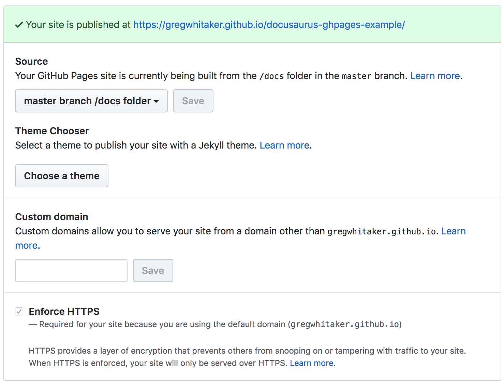

# docusaurus-ghpages-example

An example of building a [Docusaurus](https://docusaurus.io/) website with [Gradle](https://www.gradle.org) and deploying it to GitHub Pages.

## Prerequisites
Serving the example application with Github Pages requires that Github Pages has been activated for the repository and it is configured to serve content from the `/docs` folder.

## Building the Site
Run the following command to build the site:

    ./gradlew clean buildSite

## Serving the Site Locally
To view website changes locally before committing to Github, run the following command:

    ./gradlew runSite

## Deploying the Site to GitHub Pages
Follow the steps below to build the site and deploy it to GitHub pages:

1. Run the following command to build the site and stage it for release:

        ./gradlew deploySite

2. Commit the changes to the `master` branch in GitHub.

## License
MIT License

Copyright (c) 2019 Greg Whitaker

Permission is hereby granted, free of charge, to any person obtaining a copy
of this software and associated documentation files (the "Software"), to deal
in the Software without restriction, including without limitation the rights
to use, copy, modify, merge, publish, distribute, sublicense, and/or sell
copies of the Software, and to permit persons to whom the Software is
furnished to do so, subject to the following conditions:

The above copyright notice and this permission notice shall be included in all
copies or substantial portions of the Software.

THE SOFTWARE IS PROVIDED "AS IS", WITHOUT WARRANTY OF ANY KIND, EXPRESS OR
IMPLIED, INCLUDING BUT NOT LIMITED TO THE WARRANTIES OF MERCHANTABILITY,
FITNESS FOR A PARTICULAR PURPOSE AND NONINFRINGEMENT. IN NO EVENT SHALL THE
AUTHORS OR COPYRIGHT HOLDERS BE LIABLE FOR ANY CLAIM, DAMAGES OR OTHER
LIABILITY, WHETHER IN AN ACTION OF CONTRACT, TORT OR OTHERWISE, ARISING FROM,
OUT OF OR IN CONNECTION WITH THE SOFTWARE OR THE USE OR OTHER DEALINGS IN THE
SOFTWARE.